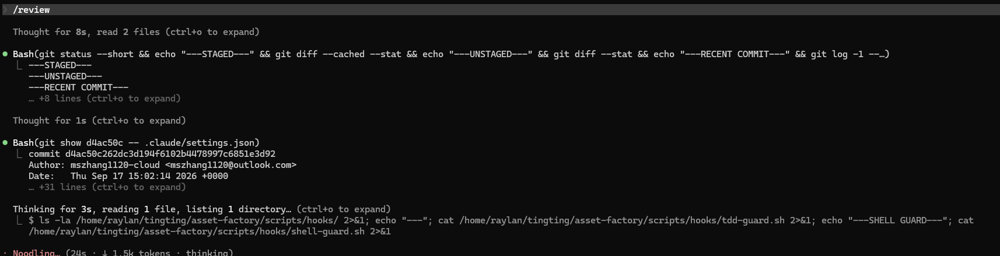
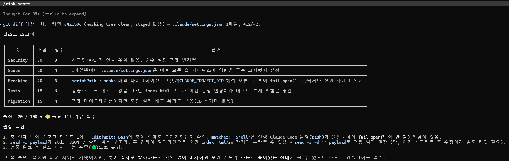
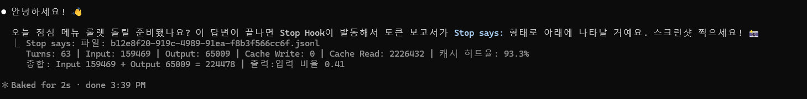

## 완료 LAB 목록
LAB01, LAB02, LAB05, LAB06, LAB10
### 종합 관찰
1. PreToolUse 훅을 이용해 AI의 작업을 시작하기 전에 규칙을 적용하고 위험한 행위를 차단할 수 있다.
2. repo-grade로 프로젝트 문서를 평가하면 규칙 문서의 누락과 오류를 객관적으로 발견할 수 있다.
3. 훅이 작동하지 않을 때는 세션을 재시작하는 것이 가장 효과적인 해결 방법이다.

## 증거 스크린샷

### 코드 리뷰 (/review)

### 리스크 스코어 (/risk-score)

### Stop 훅 토큰 보고서

